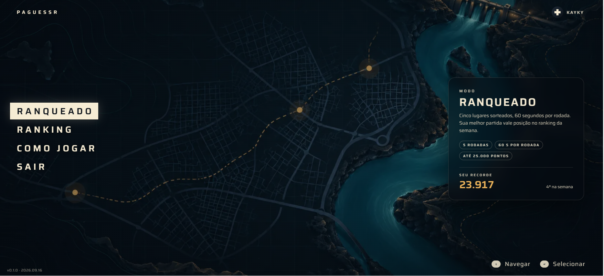
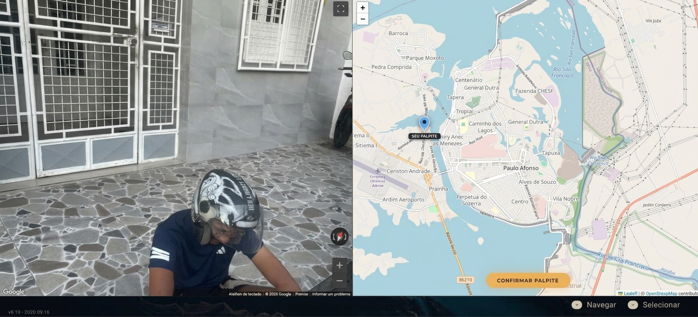

# PAguessr


Este projeto foi desenvolvido para a matéria de Jogos Digitais do curso de Sistemas de Informação do Centro Universitário do Rio São Francisco - UniRios, ministrada pelo Professor Dr. Erick Barros.

PAguessr é um Jogo de adivinhação geográfica (inspirado no GeoGuessr) focado exclusivamente na cidade de Paulo Afonso-BA.


> Tela Inicial do jogo com características e pontos turísticos importantes da cidade.



> Esse é o menu do jogo, onde o usuário pode acessar o ranking, modo de jogo ou tutoriais.



> Interface com o mapa da cidade onde o jogador deve selecionar no mapa a localização da imagem.

### Ajustes e melhorias

O jogo ainda está em desenvolvimento e as próximas atualizações serão voltadas para as seguintes tarefas:

- [x] Melhorias de Geolocalização
- [x] Modo de Jogo - Casual
- [ ] Modo de Jogo - Hardcore
- [ ] Modo de Jogo - Multiplayer

## 💻 Pré-requisitos

Requisitos:

- `Node.js >= 22`
- `pnpm >= 11`
- `Docker e Docker Compose`.

## ☕ Estrutura do Projeto

- `apps/api`: Backend Fastify + TypeScript + Drizzle ORM + PostgreSQL
- `apps/web`: Frontend React + Vite + TypeScript + Leaflet
- `packages/shared`: Tipos comuns, cálculo de distância Haversine e pontuação

## ⚙️ Configuração

Copie o arquivo de variáveis de ambiente:

```bash
cp .env.example .env
```

Instale as dependências:

```bash
pnpm install
```

## 🐋 Executando com Docker Compose

Para subir todos os serviços (PostgreSQL, API e Web):

```bash
docker compose up --build
```

- Web: [http://localhost:3000](http://localhost:3000)
- API: [http://localhost:3333](http://localhost:3333)
- Health check API: [http://localhost:3333/health](http://localhost:3333/health)

## ⚡ Desenvolvimento Local

1. Suba apenas o banco de dados:

```bash
docker compose up -d postgres
```

2. Execute as migrações do banco:

```bash
pnpm db:migrate
```

3. Configure `GOOGLE_STREET_VIEW_API_KEY` no `.env` e cadastre os primeiros locais reais:

```bash
pnpm --filter @paguessr/api db:bootstrap
```

Esse comando consulta até 80 pontos próximos ao centro e para quando o banco tem 10 locais. A partida precisa de pelo menos 5. O comando `db:seed` atual está vazio e não cadastra locais. A chave precisa ter acesso à Street View Static API. Nunca envie o `.env` ao GitHub.

4. Inicie os serviços em modo de desenvolvimento:

```bash
pnpm dev
```

O frontend local abre em [http://localhost:5173](http://localhost:5173). Executar apenas o frontend não inicia a API nem o banco.

### 🎲 Banco local no Windows, sem Docker

Se o banco deste checkout já foi inicializado em `.local/postgres`, reinicie-o a partir da raiz do projeto com o PostgreSQL 17 instalado:

```powershell
& 'C:/Program Files/PostgreSQL/17/bin/pg_ctl.exe' -D .local/postgres -l .local/postgres.log -o '-h 127.0.0.1 -p 5434' -w start
pnpm dev
```

Não execute o comando de iniciar o banco se ele já estiver rodando. Essa pasta contém apenas dados locais, ignorados pelo Git; novos clones precisam configurar seu próprio banco seguindo os passos acima.

## 🎈 Testes

Os testes da API rodam contra um banco **separado** do de desenvolvimento (`paguessr_test`, no lugar de `paguessr`), para nunca apagar locais reais coletados via `pnpm coverage`. Esse banco é criado automaticamente na primeira vez que o container do Postgres sobe (`docker compose up -d postgres`). Se o seu `postgres_data` já existia antes dessa mudança, crie o banco manualmente uma vez:

```bash
docker compose exec postgres createdb -U postgres paguessr_test
```

Depois, rode as migrações nele e os testes:

```bash
pnpm db:migrate:test
```

```bash
pnpm test
```

Outros comandos úteis:

```bash
pnpm lint
```

```bash
pnpm typecheck
```

```bash
pnpm format
```

## 🤝 Colaboradores

Este projeto foi desenvolvido para a matéria de Jogos Digitais do curso de Sistemas de Informação do Centro Universitário do Rio São Francisco - UniRios, ministrada pelo Professor Dr. Erick Barros:

<table>
  <tr>
    <td align="center">
      <a href="#" title="Bruno de Medeiros">
        <br>
        <sub>
          <b>Bruno de Medeiros</b>
        </sub>
      </a>
    </td>
    <td align="center">
      <a href="#" title="Tiago Elias">
        <br>
        <sub>
          <b>Tiago Elias</b>
        </sub>
      </a>
    </td>
    <td align="center">
      <a href="#" title="José Kayky">
        <br>
        <sub>
          <b>José Kayky</b>
        </sub>
      </a>
    </td>
    <td align="center">
      <a href="#" title="Guilherme Augusto">
        <br>
        <sub>
          <b>Guilherme Augusto</b>
        </sub>
      </a>
    </td>
    <td align="center">
      <a href="#" title="Jean Carlos">
        <br>
        <sub>
          <b>Jean Carlos</b>
        </sub>
      </a>
    </td>
    <td align="center">
      <a href="#" title="Matheus Menezes">
        <br>
        <sub>
          <b>Matheus Menezes</b>
        </sub>
      </a>
    </td>
  </tr>
</table>
